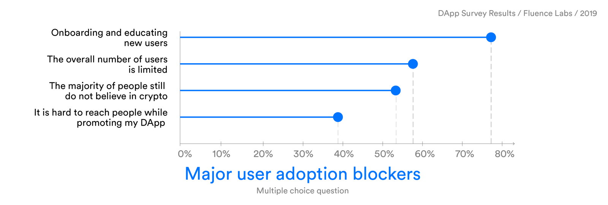

# MetaTransactiosn_UniversalLogins_Proxy Registry 

According to Fluence Dapp  2019 [https://medium.com/fluence-network/dapp-survey-results-2019-a04373db6452](https://medium.com/fluence-network/dapp-survey-results-2019-a04373db6452)  Survey poor user experience is major pain point for developers

Some of the Feedbacks By Dapp Developers on user experience are :

-------------------------------------------

 
How meta transactions works ? : - https://medium.com/@andreafspeziale/understanding-ethereum-meta-transaction-d0d632da4eb2

1.  Creating a wallet, getting coins, and explaining what gas is were mentioned among the aspects that developers found difficult to explain when they first reached out to their audiences.

2. Getting them started with a wallet and explaining that they’ll have to ‘sign in’ to that wallet using widely varying software, some of which has a high incidence of fraud and failure, and that they can’t ever lose (or change!) that password or else they’ll permanently lose access to everything — that’s a hard sell without some seriously good onboarding tools.

3. New users don’t understand how much gas they should set. — Riot Cats

4. Getting them Ether is still the hardest challenge. The number of people who have Ether off of an exchange is tiny.” — Daxia
5. Onboarding. Once the wallet is set up and Ether is in hand, our experience is pretty easy to understand.” — Anonymous

6. If even creating the wallet is too much hassle for developers, how can we expect less tech-savvy users to adopt crypto with the current awful UX?” — FundRequest

7. At the moment, the steps of creating an EOS wallet are complicated. Besides, the concept of CPU usage time and RAM are difficult for normal people. These are the obstacles for people to play DApps.” — Dice

8. Some respondents working on Ethereum-based DApps reported that the MetaMask user experience could be improved. One of the mentioned reasons was that individually signing every transaction causes too much friction, especially for complex applications.

9. For the simple one-tab games, Metamask works fine. But complex games like Chibi Fighters that can be played in 10 tabs simultaneously make it pop all over the place.” — Chibi Fighters

10. Having to sign every TX in Metamask. — FABG

11. We lack an OAuth2-style flow in which a user can sign up for the first time and port that [identity] to other platforms. This is the single biggest issue with Be Your Own Bank / IDentity Manager.” — Anonymous

--------------------

Github Repo / Developers / Projects Who are using/working on  meta Trsansactions / Universal Logins

1. https://github.com/ethereum/EIPs/blob/master/EIPS/eip-1078.md

2. http://twitter.com/austingriffith?lang=en

3. https://medium.com/@abcoathup/evolution-of-decentralised-social-media-dfe567d23e54

4. https://www.youtube.com/watch?v=qF2lhJzngto&feature=youtu.be

5. https://github.com/status-im/contracts/tree/master/contracts/identity

6. https://github.com/uport-project/lambda-sensui

7. https://medium.com/@avsa/universal-logins-update-new-live-demo-b3d5dcbec681

8. https://www.youtube.com/watch?v=GQDxKRqEKEo

9. https://www.youtube.com/watch?v=9gyZRq162A8

10. https://www.youtube.com/watch?v=gv5EF8_u4Ks&feature=youtu.be&t=534

11. https://github.com/horizon-games/ERC20-meta-wrapper

12. https://github.com/ConsenSys/SensuiMod

13. https://github.com/uport-project/lambda-sensui

14. https://media.consensys.net/operation-spring-mainstream-e-commerce-on-the-ethereum-blockchain-6b65f870cb16

15. https://www.youtube.com/channel/UC5rc5OmS0BlqMbUfFrXpxag

16. https://medium.com/8xprotocol

17. https://medium.com/@austin_48503/ethereum-meta-transactions-90ccf0859e84

18. https://medium.com/coinmonks/gasless-transactions-f75382095c4f

19. https://www.youtube.com/watch?v=y_eMO0kX3Ws

20. https://medium.com/gitcoin/technical-deep-dive-architecture-choices-for-subscriptions-on-the-blockchain-erc948-5fae89cabc7a

21.https://medium.com/gitcoin/eip-1337-subscriptions-launches-eacbb947e229

22. https://medium.com/@e2toe4/ethereum-meta-transactions-36f10448619

23.https://www.stateofthedapps.com/dapps/ethbattle -https://www.reddit.com/r/ethereum/comments/aqaxx8/ive_implemented_eth_metatransactions_for_my_game/

24. https://github.com/tabookey/tabookey-gasless

25. https://medium.com/groundhog-network/the-gas-station-network-alliance-6fd543e7eca3

26. https://marmo.io

27. https://hackernoon.com/ethereum-ux-tools-the-ultimate-guide-aad1cd2c128

28. https://medium.com/nifty-gateway/introducing-the-nifty-gateway-wallet-bd55acf76cd0

29. https://medium.com/lamarkaz/dai-in-the-hands-of-all-8ed335879ae9

